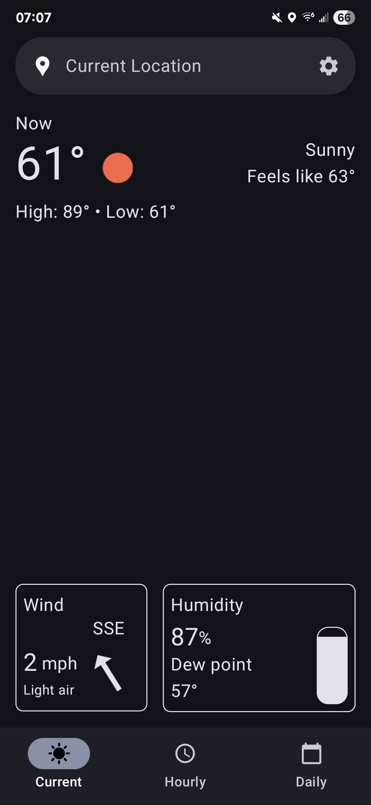
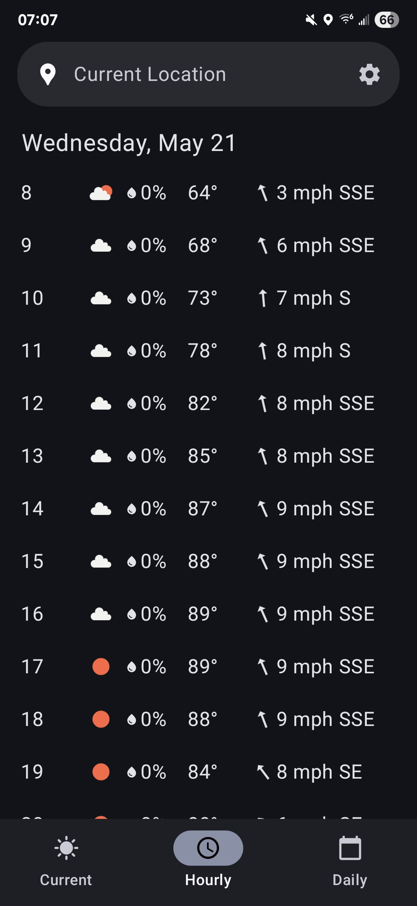
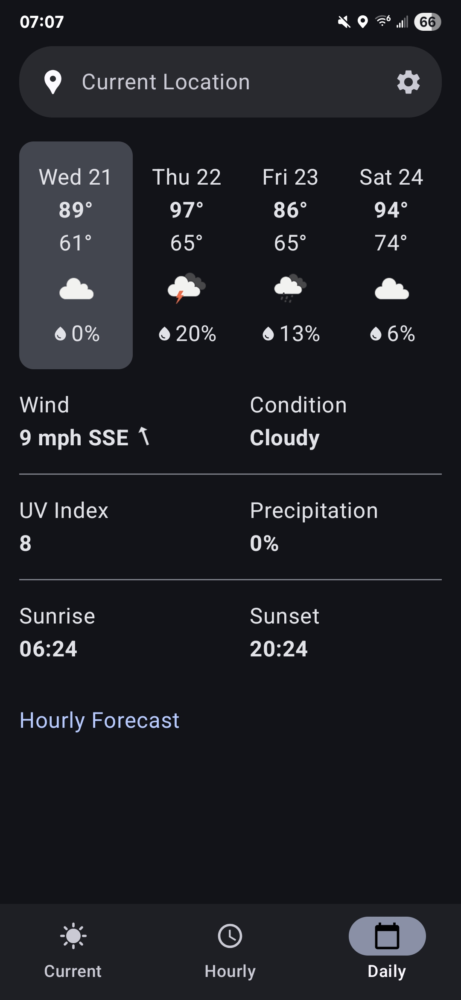
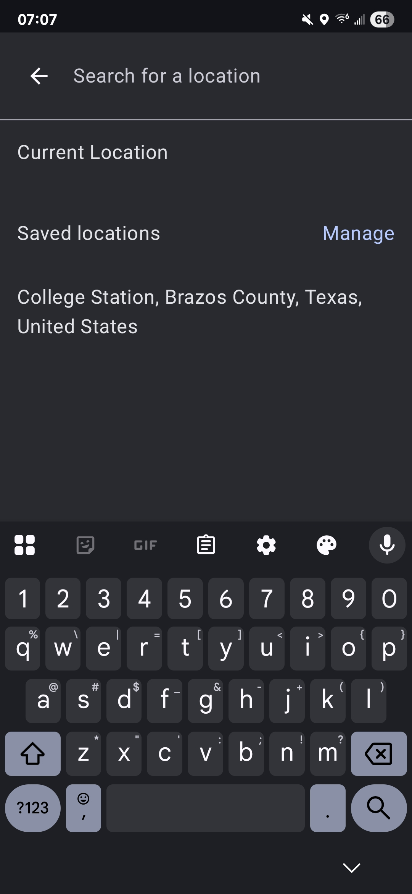
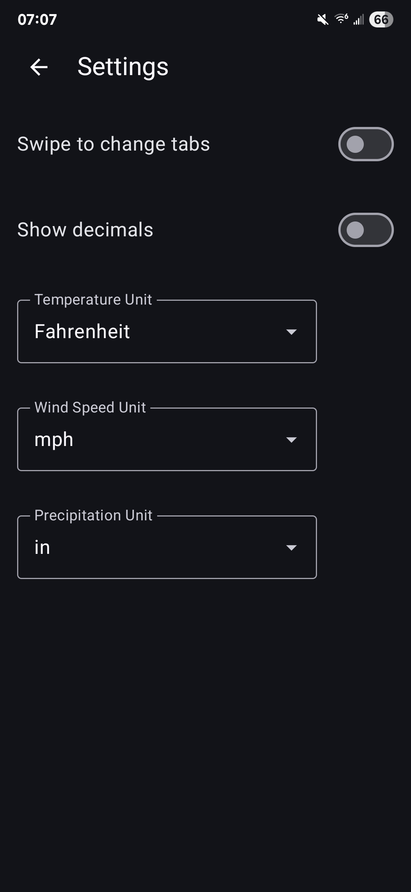

This is a weather app that I decided to create because I didn't like the current options. It uses the [Open-Meteo](https://open-meteo.com/) API for getting the weather data. It's a work in progress and I have lots of planned features.

Current features:
- Get weather for current location
- Manage saved locations
- Hourly weather for 15 days
- App preferences, including weather units
- Using clock format based on device settings

 

 

 

 

 

 

 

 

 

 
